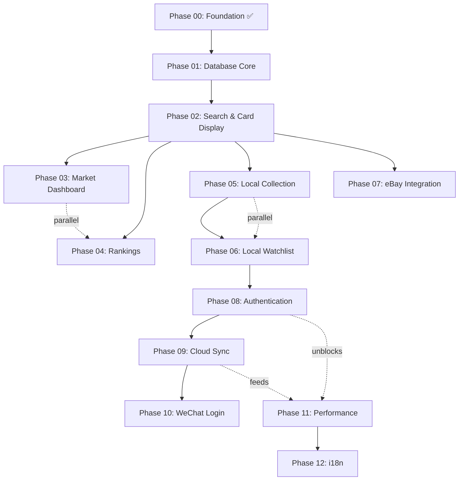

# CardTrail Implementation Roadmap (Auth Deferred)

Restructured development plan that unlocks core functionality while deferring authentication and cloud-sync work until external credentials are ready. This roadmap assumes **Phase 00 is complete** and focuses on delivering a locally usable CardTrail experience before layering in auth.

## Overview

- **Total Phases:** 12 (Phase 00 ✅ + 11 remaining workstreams)
- **Core Strategy:** Build search, market intelligence, and local data tools **without auth**, using localStorage/IndexedDB to unblock development
- **Auth & Cloud Sync:** Deferred to Phase 08+ when Better Auth, SMS providers, and WeChat credentials are available
- **Data Safety:** `card_jp` remains read-only; all new tables reference it via foreign keys and enforce RLS
- **Migration Path:** Local data (Phases 05-06) explicitly migrates to Supabase once auth lands in Phase 09

## Phase Summary

| Phase | Name | Focus | Status |
|-------|------|-------|--------|
| 00 | Foundation | Monorepo, Next.js, testing, bottom nav | ✅ Complete |
| 01 | Database Core | price_history, market_indices, transactions (no auth tables) | ⏳ Ready |
| 02 | Search & Card Display | Full-text search, filters, card detail, price charts | ⏳ Ready |
| 03 | Market Dashboard | CTI index, K-line chart, market overview | ⏳ Ready |
| 04 | Rankings | Price/volume/popularity rankings & comparisons | ⏳ Ready |
| 05 | Local Collection | Local portfolio storage, P&L, export/import | ⏳ Ready |
| 06 | Local Watchlist & Alerts | Local watchlist, alert checks on load, PWA prep | ⏳ Ready |
| 07 | eBay Integration | External API ingestion, CT price algorithm, cron jobs | ⏳ Ready |
| 08 | Authentication | Better Auth + SMS providers, protected routes | ⏳ Ready |
| 09 | User Data Cloud Sync | Supabase collections/watchlists + migration from local data | ⏳ Ready |
| 10 | WeChat Login & Social | WeChat OAuth, account linking, share flows | ⏳ Ready |
| 11 | Performance Optimization | Bundle/db/query tuning, monitoring | ⏳ Ready |
| 12 | Internationalization | English translations, locale-aware formatting, launch polish | ⏳ Ready |

## Dependencies & Execution Flow

### Parallel Work Windows

- **After Phase 02:** Market Dashboard (Phase 03), Rankings (Phase 04), Local Collection (Phase 05), and eBay Integration (Phase 07) can run in parallel as long as shared components stay DRY.
- **Local Data Tracks:** Phase 05 and Phase 06 can progress simultaneously; both must finish before kickoff of Phase 08 auth work.
- **Performance & i18n:** Phase 11 (Performance) and Phase 12 (i18n) planning can occur during Phase 08-10, but implementation should wait until authentication and migration are stable.

## Execution Strategy

1. **Immediate Start:** Phase 01 uses existing Supabase project and creates only public, read-only market tables. No auth dependencies.
2. **Local-First Data:** Phases 05-06 rely on localStorage + IndexedDB to enable portfolio/watchlist flows without user accounts.
3. **Data Migration Guardrails:** Every local data feature includes warnings and data-shape parity with future Supabase tables to simplify Phase 09 migration.
4. **Progressive Enhancement:** Begin with placeholder/seed data (e.g., CTI index) and enhance fidelity when eBay integration and cron jobs go live.
5. **Strict Validation:** Even for local data, use Zod schemas to ensure the migration pipeline can trust stored payloads.

## Key Design Decisions

- **Authentication Deferred:** Better Auth, SMS plugins, and WeChat all require third-party credentials not yet provisioned. Deferring prevents idle time.
- **Local Storage as Stopgap:** Users can experience the core app offline-first; data persists per-device and clearly signals upcoming cloud sync.
- **Core Tables First:** price_history, market_indices, and transactions power every market-facing screen and can be safely public under RLS.
- **RLS Everywhere:** Even read-only public tables explicitly enable RLS policies to ensure future expansion stays compliant.
- **Type Generation:** Supabase type generation (Phase 01 deliverable) keeps the Next.js app and packages typed without introducing `any`.

## Phase Details

Each phase directory (e.g., `implementation/phase-01-database-core/`) contains a README plus task files following the standard template (objective, context, requirements, implementation details, testing, acceptance criteria, dependencies, references, success metrics).

### Phase 00: Foundation ✅
- **Deliverables:** Monorepo scaffold, Next.js app, Supabase client, testing stack, bottom navigation layout.
- **Status:** Complete. Serves as baseline for subsequent phases.

### Phase 01: Database Core (No Auth)
- **Focus:** Create `price_history`, `market_indices`, and `transactions` tables with indexes, foreign keys to `card_jp`, and public read-only RLS policies.
- **Extras:** Document SQL migrations, Supabase type generation, and RLS testing strategy.

### Phase 02: Search & Card Display
- **Focus:** Full-text search on `card_jp`, filters (set, rarity, year), infinite grid, card detail page with price history chart and recent transactions.
- **Constraints:** All Supabase queries must `.limit()`. UI follows design system (pill filters, 2-column mobile grid).

### Phase 03: Market Dashboard (大盘)
- **Focus:** CTI index (placeholder first), candlestick chart, overview cards, gainers/losers, volume stats, "real-time" feel via optimistic updates.
- **Parallel:** Can run alongside Phase 04 once Phase 02 completes.

### Phase 04: Rankings (榜单)
- **Focus:** Price-change, volume, and popularity rankings with timeframe filters (24h/7d/30d), comparison view, shareable snippets.
- **Design:** Gold/silver/bronze badges, minimal dividers per design.md.

### Phase 05: Local Collection (本地持仓)
- **Focus:** Local portfolio stored under `cardtrail_collection_v1`, P&L calculations, JSON export/import, IndexedDB fallback beyond 100 items.
- **Migration Prep:** Data shape mirrors future Supabase `collections` table and flags that cloud sync arrives in Phase 09.

### Phase 06: Local Watchlist & Alerts (本地关注)
- **Focus:** Local watchlist and alert configuration, periodic price checks on app load, PWA notification scaffolding.
- **Note:** Shares schema with Phase 09 `watchlists`, includes storage quota handling.

### Phase 07: eBay Integration
- **Focus:** Connect to eBay API, implement CT Price algorithm, backfill transactions table, cron job for price updates.
- **Dependency:** Can start after Phase 02 search foundation.

### Phase 08: Authentication (Better Auth)
- **Focus:** Implement Better Auth per `planning/authentication-research.md`, phone number plugin, SMS provider integration (Aliyun/Tencent), auth UI, protected routes.
- **Prereq:** Local data features (Phase 05-06) must be final to avoid schema churn before migration.

### Phase 09: User Data Cloud Sync
- **Focus:** Create Supabase `collections`, `watchlists`, `price_alerts`, plus migration plan from localStorage/IndexedDB to cloud with conflict resolution and rollback strategy.
- **Deliverable:** Documented migration service + user-facing progress indicators/toasts.

### Phase 10: WeChat Login & Social
- **Focus:** WeChat Open Platform setup, OAuth integration, account linking (phone + WeChat), social sharing modules.
- **Dependency:** Requires Phase 08 auth foundation and Phase 09 cloud data tables.

### Phase 11: Performance Optimization
- **Focus:** Bundle size reduction (<150 KB first load), image/CDN optimization, query tuning, API caching, Sentry + monitoring setup.
- **Dependencies:** Builds on stabilized data/auth stack (Phase 08-10).

### Phase 12: Internationalization (i18n)
- **Focus:** English localization, currency/date formatting, locale switching UI, final polish + launch readiness checklist.
- **Note:** Can plan in parallel but implementation waits for stabilized features to avoid duplicate work.

## Documents & References

- `planning/agents.md` – Mandatory constraints (RLS, no `any`, `card_jp` read-only)
- `planning/design.md` – Design system (colors, typography, spacing)
- `planning/feature-breakdown.md` – Feature-to-phase mapping (kept in sync with this roadmap)
- `planning/data-models.md` – Core vs user tables, localStorage schemas
- `planning/database-architecture.md` – SQL authority for migrations and policies
- `implementation/phase-00-scaffold/` – Completed baseline reference

## Progress Tracking

- **Current Entry Point:** Phase 01 – Core database tables
- **Milestone:** Phases 01-04 deliver a fully browseable market app with mock/placeholder data where needed
- **Local Data Milestone:** Phases 05-06 ensure users can manage data locally while auth is deferred
- **Auth Milestone:** Phases 08-10 transition app to authenticated, cloud-synced experience, enabling Phase 11-12 polish

Keep this roadmap synced with planning documents and task files. Any scope changes must update both this README and the corresponding phase directories to avoid drift.
